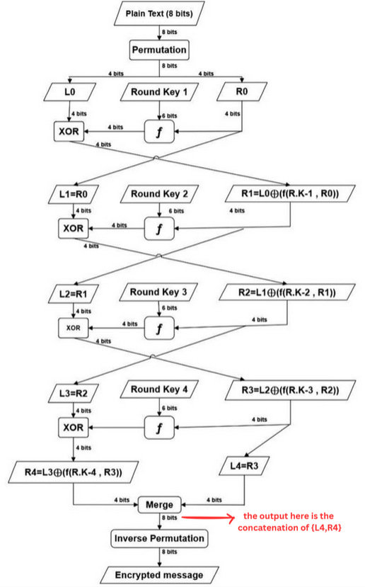
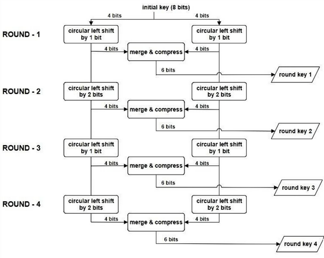
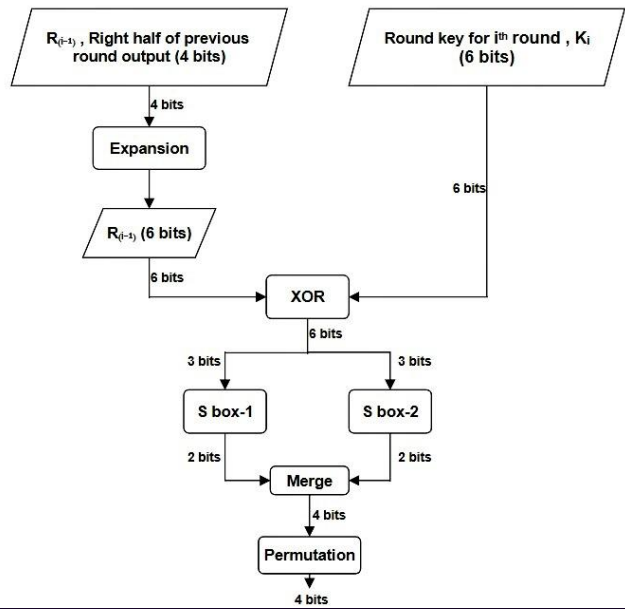

<h3>Table of Contents</h3>
<ul>
    <li><a href="#introduction">Introduction</a></li>
    <li><a href="#overview">Overview</a></li>
    <li><a href="#implementation">Implementation</a></li>
    <li><a href="#installation-and-setup">Installation and Setup</a></li>
    <li><a href="#usage">Usage</a></li>
    <li><a href="#results-and-performance">Results and Performance</a></li>
    <li><a href="#future-work">Future Work</a></li>
    <li><a href="#team">Team</a></li>
</ul>

<h3 id="introduction">Introduction</h3>
<div>
    This project presents a simplified implementation of the <b>DES (Data Encryption Standard)</b> algorithm, specifically tailored for educational purposes. The primary goal is to leverage fundamental cryptography principles to understand the applications of this algorithm in secure communication protocols, smart cards, and network security.
    <br><br>
    The project centers around an <b>8-bit encryption scheme</b>, inspired by the simplified DES algorithm. The process begins with an initial <b>8-bit key</b>, which is then divided into <b>four 6-bit round keys</b>. The encryption process involves transforming an 8-bit plaintext through <b>four rounds</b>, each incorporating a unique round key. Each round adds progressive layers of complexity and security, making the encryption more robust.
</div>

<h3 id="overview">Overview</h3>
<div>
    <b>Inputs</b>
    <ul>
        <li>8 bit plain text (the message to be encrypted)</li>
        <li>8 bit initial KEY</li>
    </ul>
    <table border="1">
    <tr>
        <td><b>Initial Plain Text Indices</b></td>
        <td>1</td>
        <td>2</td>
        <td>3</td>
        <td>4</td>
        <td>5</td>
        <td>6</td>
        <td>7</td>
        <td>8</td>
    </tr>
    <tr>
        <td><b>Permuted Indices</b></td>
        <td>3</td>
        <td>4</td>
        <td>8</td>
        <td>7</td>
        <td>1</td>
        <td>2</td>
        <td>5</td>
        <td>6</td>
    </tr>
    </table>
    <br>
    <table border="1">
    <tr>
        <td><b>8 bit Plain Text Message</b></td>
        <td>1</td>
        <td>1</td>
        <td>0</td>
        <td>1</td>
        <td>0</td>
        <td>0</td>
        <td>1</td>
        <td>0</td>
    </tr>
    <tr>
        <td><b>Permuted Message</b></td>
        <td>0</td>
        <td>1</td>
        <td>0</td>
        <td>1</td>
        <td>1</td>
        <td>1</td>
        <td>0</td>
        <td>0</td>
    </tr>
    </table>
    <br>
    <ul>
        <li>
            After the plaintext has been permuted using the initial permutation table, the string is split into two halves: the right half (R0) and the left half (L0), each consisting of 4 bits.
        </li>
        <li>
            For each round <em>i</em>, a round key <em>RK<sub>i</sub></em> is generated. During each round, the right half <em>R<sub>i</sub></em> (4 bits) is manipulated using a function <em>f</em>. The inputs to this function are the right half <em>R<sub>i</sub></em> and the round key <em>RK<sub>i</sub></em> (6 bits).
        </li>
        <li>
            The output of the function <em>f</em> (4 bits) is then XORed with the left half <em>L<sub>i</sub></em> of the plaintext.
        </li>
        <li>
            The result of the XOR operation becomes the new right half for the next round. The right half of the current round <em>R<sub>i</sub></em> becomes the left half for the next round <em>L<sub>i+1</sub></em>.
        </li>
        <li>
            After completing round 4, the final halves <em>R<sub>4</sub></em> and <em>L<sub>4</sub></em> are merged and undergo an inverse permutation using the inverse permutation table provided below.
        </li>
    </ul>
    <br>
    <table border="1">
        <tr>
            <th>Merged Output Indices</th>
            <td>1</td>
            <td>2</td>
            <td>3</td>
            <td>4</td>
            <td>5</td>
            <td>6</td>
            <td>7</td>
            <td>8</td>
        </tr>
        <tr>
            <th>Inverse Permuted Indices</th>
            <td>5</td>
            <td>6</td>
            <td>1</td>
            <td>2</td>
            <td>7</td>
            <td>8</td>
            <td>4</td>
            <td>3</td>
        </tr>
    </table>
    <br>
    
    <br><br>
    <h4>Round Key Generation</h4>
    <br>
    
    <br><br>
    <div>
        Note that the <b>compression of 8 bits into 6 bits</b> is done with respect to the below <b>compression box</b>
    </div><br>
    <table border="1">
        <tr>
            <th>8 bit input indices</th>
            <td>1</td>
            <td>2</td>
            <td>3</td>
            <td>4</td>
            <td>5</td>
            <td>6</td>
            <td>7</td>
            <td>8</td>
        </tr>
        <tr>
            <th>6 bit output indices</th>
            <td>3</td>
            <td>1</td>
            <td>7</td>
            <td>4</td>
            <td>8</td>
            <td>6</td>
        </tr>
    </table>
    <h4>Function <em>f</em></h4>
    The round function f takes two inputs :
    <ul>
        <li>The right half (4 bits)</li>
        <li>ROUND_KEY (6 bits)</li>
    </ul>   
    The right half is first expanded (and simultaneously permuted) to 6 bits using the below <b>expansion box</b>.
    <br><br>
    <table border="1">
        <tr>
            <th>Input Indices</th>
            <td>1</td>
            <td>2</td>
            <td>3</td>
            <td>4</td>
        </tr>
        <tr>
            <th>Output Indices</th>
            <td>4</td>
            <td>3</td>
            <td>2</td>
            <td>2</td>
            <td>1</td>
            <td>2</td>
        </tr>
    </table>
    <div>
        After the XOR operation , the 6 bits are split into 3 bits each (left and right) and sent into two S boxes.
    </div>
    <br>
    
    <br>
    <h4>Working of S boxes</h4>
    <div>
        The two S boxes each take <b>3 bit inputs and produce a 2 bit output</b>. For a given three bit input , the middle bit represents the row number and the outer two bits represent the column number. The output of the S box is a two bit value that is present in the cell that intersects the row and column. The two S boxes are as follows.
    </div>
    <br>
    
    <br><br>
    <div>
        The two 2-bit outputs are merged and permuted according to the below <b>permutation table</b>
    </div>
    <br>
    <table border="1">
        <tr>
            <th>Input Indices</th>
            <th>1</th>
            <th>2</th>
            <th>3</th>
            <th>4</th>
        </tr>
        <tr>
            <th>Output Indices</th>
            <td>4</td>
            <td>1</td>
            <td>3</td>
            <td>2</td>
        </tr>
    </table>
    <div>
        This permuted result is the final output of the round function. In this manner , the key generation and round function blocks are combined in a way to complete the encryption process in 4 distinct rounds.
    </div>
</div>

<h3 id="implementation">Implementation</h3>
<div>
    A MATLAB script has been developed to implement a simplified version of the DES algorithm, as illustrated in the attached flow chart. The script includes several functions, which are outlined below:
    <br><br>
    <ul>
        <li>
            <code>des_algorithm</code>: calls <code>initial permutation</code> and <code>encrypt_message</code> function on the input message.
        </li>
        <li>
            <code>initial_permutation</code>: responsible for performing initial permutation on the input message.
        </li>
        <li>
            <code>encrypt_message</code>: executes the encryption rounds using the generated round keys.
        </li>
        <li>
            <code>generate_round_key</code>: generates round keys for each encryption round using circular shifts and compression box.
        </li>
        <li>
            <code>f</code>: applies a sequence of operations including expansion box, XOR (.^), S-box substitution and permutation to the right half of current round message and the ROUND KEY.
        </li>
        <li>
            <code>s_box_one</code>: perform substitution as per S-box 1, mapping 3-bit input to 2-bit.
        </li>
        <li>
            <code>s_box_two</code>: perform substitution as per S-box 2, mapping 3-bit input to 2-bit.
        </li>
    </ul>
</div>

<h3 id="installation-and-setup">Installation and Setup</h3>
<blockquote>
    Please note that executing the script requires a a valid MATLAB license. In case it is not available, please navigate to <a href="https://matlab.mathworks.com/">MATLAB Online</a> and upload the script there.
</blockquote>

<div>
    Clone the repo using the command <code>git clone https://github.com/asood-life/des-algorithm-implementation.git</code>
    <h4>Folder Structure</h4>
</div>

```
│   script.m
│   LICENSE
│   README.md
│
└───assets
        algorithm-flowchart.png
        function-f.png
        round-key-generation.png
        s-box.png
```

<h3 id="usage">Usage</h3>
<div>
    Open <code>script.m</code> in MATLAB. Within this script, use the variables <code>input_message</code> and <code>initial_key</code> to provide the desired input. Once configured, execute the script to observe the encrypted message in console. 
</div>

<h3 id="results-and-performance">Results and Performance</h3>
The MATLAB script successfully implements a version of the DES algorithm as proposed. It takes as input an 8-bit plaintext message and an 8-bit initial key, encrypting it according to the algorithm flow described earlier.
<h4>Sample Input</h4>

```
input_message = [1 1 0 1 0 0 1 0];  % 8-bit input message (plaintext)
initial_key = [1 0 1 1 0 0 1 1];    % 8-bit initial key
```
    
<h4>Sample Output</h4>

```
Initial Permuted Message: 
    0     1     0     1     1     1     0     0

ROUND KEY for Round 1:  
    1     0     1     1     0     1

ROUND KEY for Round 2:  
    0     1     0     1     1     0

ROUND KEY for Round 3:  
    1     1     1     1     1     0

ROUND KEY for Round 4:  
    1     1     0     0     0     1
    
Encrypted Message:
    0     0     0     1     0     1     0     0
```

The script takes just <b>0.008066 seconds</b> to encrypt the provided message. 

<h3 id="future-work">Future Work</h3>
<div>
    As the project progresses, the next crucial step involves designing an optimized digital circuit. Several key components have been identified for potential integration into the circuit.
    <br><br>
    <table border="1">
        <thead>
            <tr>
                <th>Component</th>
                <th>Cost</th>
            </tr>
        </thead>
        <tbody>
            <tr>
                <td>Counter</td>
                <td>2.0 Rs</td>
            </tr>
            <tr>
                <td>Comparator</td>
                <td>2.0 Rs</td>
            </tr>
            <tr>
                <td>Multiplexer</td>
                <td>2.0 Rs</td>
            </tr>
            <tr>
                <td>Adder</td>
                <td>2.0 Rs</td>
            </tr>
            <tr>
                <td>Flip Flops</td>
                <td>1.0 Rs</td>
            </tr>
            <tr>
                <td>Encoder</td>
                <td>2.0 Rs</td>
            </tr>
            <tr>
                <td>Decoder</td>
                <td>2.0 Rs</td>
            </tr>
            <tr>
                <td>Register</td>
                <td>2.0 Rs</td>
            </tr>
            <tr>
                <td>Logic Gates</td>
                <td>0.1 Rs</td>
            </tr>
            <tr>
                <td>Buffer</td>
                <td>0.1 Rs</td>
            </tr>
            <tr>
                <td>Clock</td>
                <td>40 Rs</td>
            </tr>
        </tbody>
    </table>
    <br>
    The end objective is to construct an optimized digital circuit that effectively implements a simplified version of the DES algorithm, while keeping costs to a minimum. 
</div>

<h3 id="team">Team</h3>
<div>
    <table>
        <tr align="center">
            <td>
                <br>
                <a href="https://github.com/asood-life">Akshat Sood</a>
            </td>
        </tr>
    </table>
</div>
<hr>
<div>
    Thank you for taking the time to go through this project! If you find it valuable, please consider giving it a ⭐ star. Your support is appreciated and helps others in discovering the project. Should you have any enhancement requests or encounter a bug, please report it in the <a href="https://github.com/asood-life/des-algorithm-implementation/issues">Issues</a> section. Your feedback is crucial in improving this project for all.
</div>
